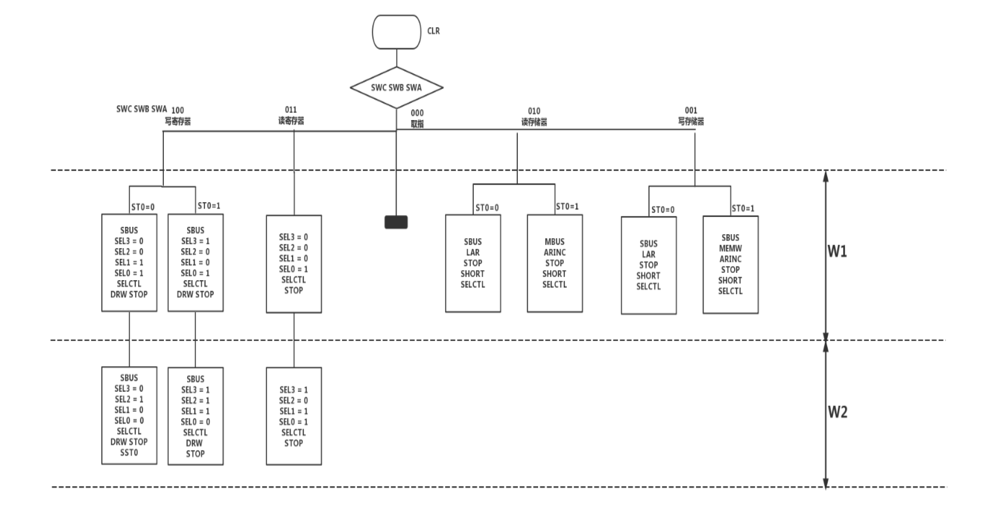
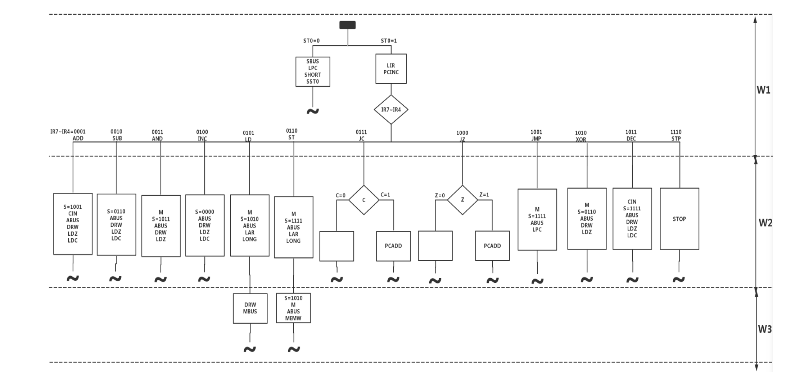
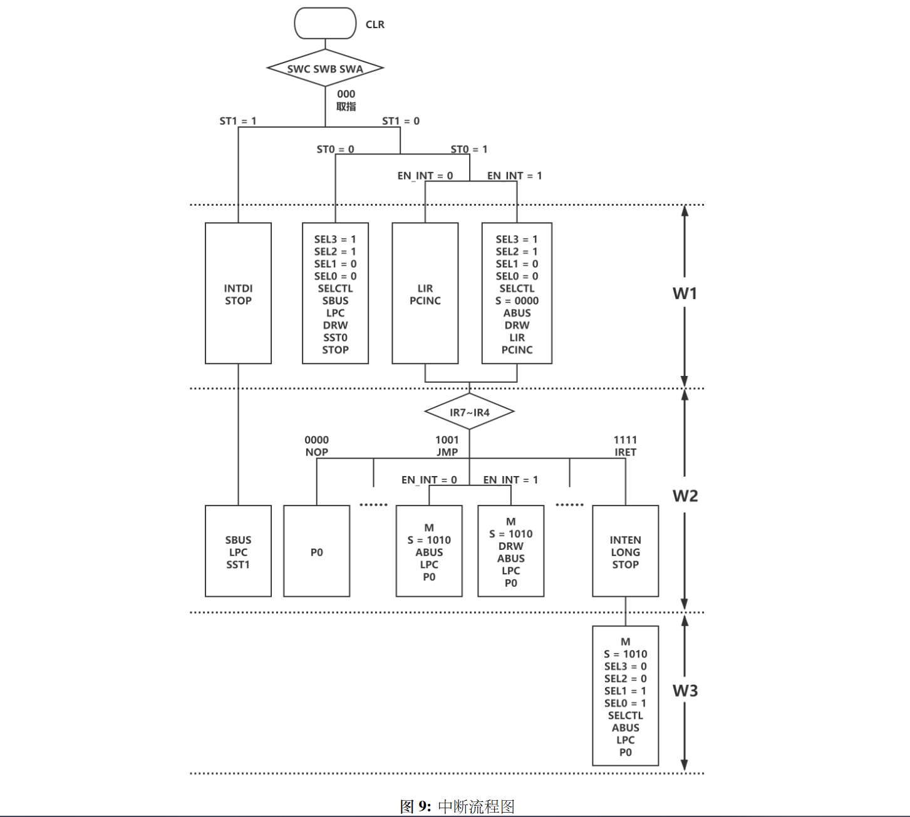

NAME      | ADD      | SUB      | AND      | INC      | LD       | ST       | JC       | JZ       | JMP      | *XOR     | *DEC     | *STP     | WREG1    | WREG2    | RREG     | WSTO1    | WSTO2    | RSTO1    | RSTO2    | PC
----------|----------|----------|----------|----------|----------|----------|----------|----------|----------|----------|----------|----------|----------|----------|----------|----------|----------|----------|----------|---------
IR+sw+st0 | 00010001 | 00100001 | 00110001 | 01000001 | 01010001 | 01100001 | 01110001 | 10000001 | 10010001 | 10100001 | 10110001 | 11100001 | 00001000 | 00001001 | 00000110 | 00000010 | 00000011 | 00000100 | 00000101 | 00000000
LIR       | W1       | W1       | W1       | W1       | W1       | W1       | W1       | W1       | W1       | W1       | W1       | W1       |          |          |          |          |          |          |          |
PCINC     | W1       | W1       | W1       | W1       | W1       | W1       | W1       | W1       | W1       | W1       | W1       | W1       |          |          |          |          |          |          |          |
S[3]      | W2       |          | W2       |          | W2       | W2+W3    |          |          | W2       |          | W2       |          |          |          |          |          |          |          |          |
S[2]      |          | W2       |          |          |          | W2       |          |          | W2       | W2       | W2       |          |          |          |          |          |          |          |          |
S[1]      |          | W2       | W2       |          | W2       | W2+W3    |          |          | W2       | W2       | W2       |          |          |          |          |          |          |          |          |
S[0]      | W2       |          | W2       |          |          | W2       |          |          | W2       |          | W2       |          |          |          |          |          |          |          |          |
CIN       | W2       |          |          |          |          |          |          |          |          |          | W2       |          |          |          |          |          |          |          |          |
ABUS      | W2       | W2       | W2       | W2       | W2       | W2+W3    |          |          | W2       | W2       | W2       |          |          |          |          |          |          |          |          |
DRW       | W2       | W2       | W2       | W2       | W3       |          |          |          |          | W2       | W2       |          | W1+W2    | W1 +W2   |          |          |          |          |          |
LDZ       | W2       | W2       | W2       | W2       |          |          |          |          |          | W2       | W2       |          |          |          |          |          |          |          |          |
LDC       | W2       | W2       |          | W2       |          |          |          |          |          |          | W2       |          |          |          |          |          |          |          |          |
M         |          |          | W2       |          | W2       | W2+W3    |          |          | W2       | W2       |          |          |          |          |          |          |          |          |          |
LAR       |          |          |          |          | W2       | W2       |          |          |          |          |          |          |          |          |          | W1       |          | W1       |          |
LONG      |          |          |          |          | W2       | W2       |          |          |          |          |          |          |          |          |          |          |          |          |          |
PCADD     |          |          |          |          |          |          | W2&&C    | W2&&Z    |          |          |          |          |          |          |          |          |          |          |          |
LPC       |          |          |          |          |          |          |          |          | W2       |          |          |          |          |          |          |          |          |          |          | W1
STOP      |          |          |          |          |          |          |          |          |          |          |          | W2       | W1+W2    | W1+W2    | W1 +W2   | W1       | W1       | W1       | W1       | W1
MBUS      |          |          |          |          | W3       |          |          |          |          |          |          |          |          |          |          |          | W1       |          |          |
MEMW      |          |          |          |          |          | W3       |          |          |          |          |          |          |          |          |          |          |          |          | W1       |
ARINC     |          |          |          |          |          |          |          |          |          |          |          |          |          |          |          |          | W1       |          | W1       |
SELCTL    |          |          |          |          |          |          |          |          |          |          |          |          | W1+W2    | W1+W2    | W1+W2    |          |          |          |          |
SBUS      |          |          |          |          |          |          |          |          |          |          |          |          | W1+w2    | W1+w2    |          | W1       |          | W1       | W1       | W1
SHORT     |          |          |          |          |          |          |          |          |          |          |          |          |          |          |          | W1       | W1       | W1       | W1       | W1
SEL3      |          |          |          |          |          |          |          |          |          |          |          |          |          | W1+W2    | W2       |          |          |          |          |
SEL2      |          |          |          |          |          |          |          |          |          |          |          |          | W2       | W2       |          |          |          |          |          |
SEL1      |          |          |          |          |          |          |          |          |          |          |          |          | W1       | W2       | W2       |          |          |          |          |
SEL0      |          |          |          |          |          |          |          |          |          |          |          |          | W1       | W1       | W1 +W2   |          |          |          |          |
SST0      |          |          |          |          |          |          |          |          |          |          |          |          | W2       |          |          | W1       |          | W1       |          | W1

<details>
<summary>流程图(点我)</summary>




</details>

# 中断

## 设计思路

* 增加pulse输入, 作为开始中断的信号; 增加interrupt_musk作为中断屏蔽位.

当pulse上升沿的时候, 置中断标志位 `interrupt_flag <= 1'b1` , 中断屏蔽位 `interrupt_musk <= 1'b1` ; 当进入中断或执行到不允许中断的指令的时候, 置 `interrupt_musk <= 1'b1` ; 同时, 增加如下逻辑:

```verilog
// 当pulse信号输入时,置中断标志位为1
always @(posedge pulse) begin
  if(pulse) begin
    interrupt_flag <= 1'b1;
  end else begin
    interrupt_flat <= 1'b0;
  end
end
...
// clr增加清中断标志位
always@(negedge clr, negedge t3) begin
if (!clr) begin
  ...
  interrupt_flag <= 1'b0;
end
  ...
```

* 关于中断向量的保存. 在IAR因为没有提供引脚而无法使用的情况下, 可以通过保存在通用寄存器中的方式解决.

因此, 要占用一个通用寄存器R3作为PC的镜像而不能作为其他使用.
为了确保中断能正常返回, 增加中断返回指令IRET.
关于保存的时机, 有两种思路:
1. 当((interrupt_flag == 1'b1) && (interrupt_musk == 1'b0))时, 将PC值存到R3中, 读[D7:D0]值到PC, 继续运行; 当读到中断返回指令IRET时, 从R3中读之前保存的PC值到PC中, 返回现场, 继续运行.
   * 但由于PC值读出只能到双端口RAM中, 再从RAM传送到R3需要消耗至少6个节拍点位, 过于费时, 所以放弃.
2. 在PCINC, PCADD和LPC指令执行的时候, 同步操作R3中的值, 即将R3作为PC的镜像; 当((interrupt_flag == 1'b1) && (interrupt_musk == 1'b0))时, 直接读取[D7:D0]值到PC, 同时R3值由于((interrupt_flag == 1'b1) && (interrupt_musk == 1'b0))而停止变化; 
<details>
<summary>中断流程图</summary>



</details>
